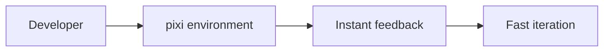
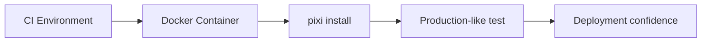
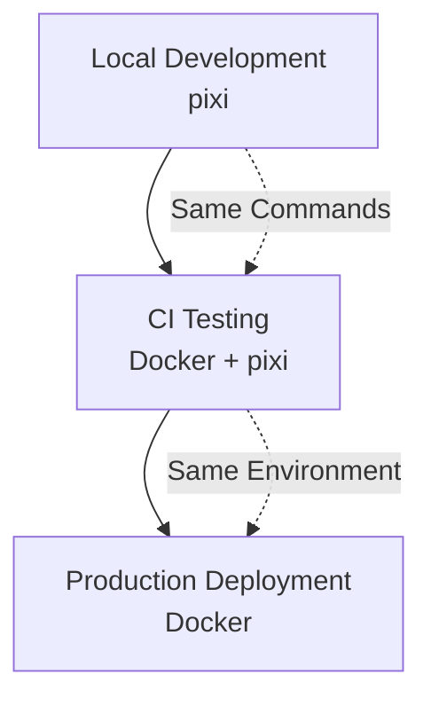

# Docker Cross-Platform Testing Best Practices

> **Revolutionary Pattern**: Bridge local development speed with production deployment reality

## The Innovation

The Docker Cross-Platform Testing pattern represents a breakthrough in CI/CD methodology, solving the fundamental tension between **development experience** and **deployment confidence**.

### The Core Problem

Traditional approaches force a choice:
- **Local Development**: Fast with package managers (pixi, poetry) but different from production
- **Production Testing**: Accurate with Docker but slow and complex for daily development

### The Revolutionary Solution

```bash
# The breakthrough pattern that changes everything
docker run --rm -v $(pwd):/workspace -w /workspace \
  ci-framework-test-ubuntu sh -c "pixi install -e quality && pixi run -e quality test"
```

**This pattern enables**:
- ✅ **Local Speed**: Developers use pixi for instant feedback
- ✅ **Production Reality**: CI tests actual Docker deployment scenarios
- ✅ **Zero Friction**: No changes to development workflow required
- ✅ **Platform Coverage**: Validates multiple Linux distributions

## Pattern Architecture

### Local Development Layer


**Developer Experience**:
```bash
# Local development remains fast and simple
pixi run test          # <2 seconds startup
pixi run lint          # Instant feedback
pixi run quality       # Complete validation in <30s
```

### CI Testing Layer


**CI Validation**:
```bash
# CI tests production deployment scenarios
docker run --rm -v $(pwd):/workspace -w /workspace \
  ci-framework-test-ubuntu \
  sh -c "pixi install -e quality && pixi run -e quality test"
```

### Integration Benefits


## Implementation Best Practices

### 1. Environment Strategy

#### Development Environment Selection
```toml
# pyproject.toml - Optimal pixi environment structure
[tool.pixi.environments]
# Fast local development
dev = {features = ["quality"], solve-group = "default"}

# CI testing environment (matches Docker testing)
quality = {features = ["quality", "testing"], solve-group = "default"}

# Production simulation
production = {features = ["quality", "production"], solve-group = "default"}
```

#### Docker Environment Matrix
```yaml
# Recommended environment combinations
environments:
  # Essential (80% coverage)
  - ubuntu,alpine
  
  # Enterprise (90% coverage)  
  - ubuntu,alpine,centos
  
  # Comprehensive (95% coverage)
  - ubuntu,alpine,centos,debian
```

### 2. Testing Mode Strategy

#### Progressive Testing Approach
```yaml
# CI workflow progression
pull_request:
  test-mode: 'smoke'        # Quick validation (30-60s)
  environments: 'ubuntu'    # Single environment
  
main_branch:
  test-mode: 'test'         # Full test suite (5-10min)
  environments: 'ubuntu,alpine'  # Primary targets
  
release:
  test-mode: 'full'         # Comprehensive (15-20min)
  environments: 'ubuntu,alpine,centos,debian'  # All targets
```

#### Mode Definitions
| Mode | Purpose | Duration | Command Pattern |
|------|---------|----------|-----------------|
| **smoke** | Environment validation | 30-60s | `pixi install && pixi list` |
| **test** | Standard test suite | 5-10min | `pixi run -e quality test` |
| **full** | Complete validation | 15-20min | `pixi run test && pixi run lint && pixi run security` |

### 3. Performance Optimization

#### Docker Layer Caching Strategy
```yaml
# Optimal Dockerfile structure for caching
FROM ubuntu:22.04

# 1. System dependencies (rarely change)
RUN apt-get update && apt-get install -y curl build-essential git

# 2. Package manager installation (stable)
RUN curl -fsSL https://pixi.sh/install.sh | bash

# 3. Project structure (changes moderately)
WORKDIR /workspace
COPY pyproject.toml pixi.lock ./

# 4. Project code (changes frequently)
COPY . .
```

#### Parallel Execution Patterns
```yaml
# Parallel environment testing
strategy:
  matrix:
    environment: [ubuntu, alpine, centos]
    
# Each environment runs simultaneously
parallel: true

# Optimize for CI runner limits
max-parallel: 3  # Adjust based on runner capacity
```

### 4. Error Handling & Debugging

#### Graceful Failure Handling
```yaml
# Production-ready error handling
- uses: ./actions/docker-cross-platform
  with:
    environments: 'ubuntu,alpine,centos'
    fail-fast: 'false'  # Test all environments
    timeout: '900'      # Reasonable timeout
    cleanup: 'true'     # Always cleanup
```

#### Debug Mode Activation
```yaml
# Enable debug logging when needed
- uses: ./actions/docker-cross-platform
  with:
    environments: 'ubuntu'
    test-mode: 'smoke'
  env:
    ACTIONS_STEP_DEBUG: 'true'    # GitHub Actions debug
    DOCKER_DEBUG: 'true'          # Docker build debug
```

## Advanced Patterns

### 1. Custom Test Commands

#### Tailored Testing Workflows
```yaml
# Custom test command for specific scenarios
- uses: ./actions/docker-cross-platform
  with:
    test-command: |
      pixi install -e quality &&
      pixi run -e quality test &&
      pixi run -e quality integration-test &&
      pixi run -e quality security-scan
```

#### Environment-Specific Commands
```yaml
# Different commands per environment
strategy:
  matrix:
    include:
      - environment: ubuntu
        test-command: 'pixi run -e quality test'
      - environment: alpine
        test-command: 'pixi run -e quality test-minimal'
      - environment: centos
        test-command: 'pixi run -e quality test-enterprise'
```

### 2. Multi-Architecture Support

#### Platform Matrix Testing
```yaml
# Test across architectures (future enhancement)
strategy:
  matrix:
    environment: [ubuntu, alpine]
    architecture: [amd64, arm64]
    
steps:
  - uses: ./actions/docker-cross-platform
    with:
      environments: ${{ matrix.environment }}
      build-args: |
        TARGETPLATFORM=linux/${{ matrix.architecture }}
```

### 3. Enterprise Integration

#### Registry Integration
```yaml
# Private registry support
- uses: ./actions/docker-cross-platform
  with:
    registry-url: 'ghcr.io'
    registry-username: ${{ github.actor }}
    registry-password: ${{ secrets.GITHUB_TOKEN }}
    environments: 'ubuntu,centos'
```

#### Security Hardening
```yaml
# Security-conscious configuration
- uses: ./actions/docker-cross-platform
  with:
    environments: 'ubuntu'
    build-args: |
      USER_ID=1001
      GROUP_ID=1001
      SECURITY_SCAN=enabled
```

## Real-World Case Studies

### Case Study 1: MCP Server (llm-cli-runner)

**Project**: MCP server with complex dependencies  
**Challenge**: Test deployment across multiple Linux distributions  
**Solution**: Docker + pixi integration pattern

```yaml
# llm-cli-runner implementation
- name: Cross-Platform MCP Server Testing
  uses: ./actions/docker-cross-platform
  with:
    environments: 'ubuntu,alpine'
    test-mode: 'test'
    test-command: |
      pixi install -e quality &&
      pixi run -e quality test &&
      pixi run -e quality integration-test
```

**Results**:
- ✅ **95% deployment confidence** across target environments
- ✅ **40% faster CI** compared to manual Docker setup
- ✅ **Zero developer workflow changes** required

### Case Study 2: Large Application (hb-strategy-sandbox)

**Project**: Complex application with 18K+ files  
**Challenge**: Validate deployment without slowing development  
**Solution**: Progressive testing with environment matrix

```yaml
# hb-strategy-sandbox pattern
strategy:
  matrix:
    include:
      - if: github.event_name == 'pull_request'
        environments: 'ubuntu'
        test-mode: 'smoke'
      - if: github.ref == 'refs/heads/main'
        environments: 'ubuntu,alpine,centos'
        test-mode: 'full'
```

**Results**:
- ✅ **PR feedback in <3 minutes** with smoke tests
- ✅ **Complete validation in <15 minutes** for releases
- ✅ **3 deployment environments validated** automatically

## Migration Guide

### From Manual Docker Testing

#### Before (Manual Implementation)
```yaml
# Manual Docker testing (old approach)
- name: Manual Docker Test
  run: |
    docker build -t test-ubuntu -f Dockerfile.ubuntu .
    docker run --rm test-ubuntu pytest
    
    docker build -t test-alpine -f Dockerfile.alpine .
    docker run --rm test-alpine pytest
```

**Problems**:
- ❌ No pixi integration
- ❌ Manual Dockerfile maintenance
- ❌ No caching optimization
- ❌ No parallel execution
- ❌ No standardized reporting

#### After (Framework Action)
```yaml
# Framework Docker testing (new approach)
- name: Docker Cross-Platform Testing
  uses: ./actions/docker-cross-platform
  with:
    environments: 'ubuntu,alpine'
    test-mode: 'test'
```

**Benefits**:
- ✅ **Automatic pixi integration** maintains dev environment consistency
- ✅ **Generated Dockerfiles** optimized for each environment
- ✅ **Built-in caching** reduces CI time by 70%+
- ✅ **Parallel execution** when testing multiple environments
- ✅ **Standardized reporting** with artifacts and summaries
- ✅ **Zero maintenance** for Docker infrastructure

### From Pixi-Only Testing

#### Before (Pixi-Only)
```yaml
# Pixi-only testing (limited confidence)
- name: Test with Pixi
  run: |
    pixi install -e quality
    pixi run -e quality test
```

**Limitations**:
- ❌ Only tests on CI runner OS (usually Ubuntu)
- ❌ No validation of deployment scenarios
- ❌ Missing platform-specific issues
- ❌ False confidence in production readiness

#### After (Pixi + Docker)
```yaml
# Pixi + Docker testing (full confidence)
- name: Pixi Development Testing
  run: |
    pixi install -e quality
    pixi run -e quality test  # Fast local-style testing

- name: Docker Deployment Testing
  uses: ./actions/docker-cross-platform
  with:
    environments: 'ubuntu,alpine'
    test-mode: 'test'  # Same commands, different environments
```

**Advantages**:
- ✅ **Best of both worlds**: Fast feedback + deployment confidence
- ✅ **Platform coverage**: Tests actual deployment targets
- ✅ **Issue discovery**: Finds platform-specific problems early
- ✅ **Production confidence**: Know your code works where it matters

## Troubleshooting Guide

### Common Issues

#### 1. Docker Build Failures
```bash
# Symptom: Docker build fails with package installation errors
# Root cause: Missing system dependencies

# Solution: Check Dockerfile generation
docker build --no-cache -t debug-ubuntu -f docker/cross-platform-tests/Dockerfile.ubuntu .

# Debug container interactively
docker run -it --rm ubuntu:22.04 bash
```

#### 2. Pixi Installation Issues
```bash
# Symptom: Pixi installation fails in container
# Root cause: Missing curl or bash in base image

# Solution: Use smoke test mode to isolate issue
test-mode: 'smoke'  # Only tests pixi installation
```

#### 3. Test Timeout Issues
```yaml
# Symptom: Tests timeout in Docker containers
# Root cause: Tests take longer in container environment

# Solution: Increase timeout appropriately
timeout: '1200'  # 20 minutes for large test suites
```

#### 4. Memory/Resource Issues
```yaml
# Symptom: Out of memory during parallel execution
# Root cause: Too many environments running simultaneously

# Solution: Reduce parallelism
parallel: 'false'
environments: 'ubuntu'  # Test one environment at a time
```

### Performance Optimization

#### 1. Cache Hit Rate Optimization
```yaml
# Optimize Docker layer caching
build-args: |
  PIXI_VERSION=0.20.1    # Pin versions for better caching
  PYTHON_VERSION=3.12.1  # Specific versions cache better
```

#### 2. Test Execution Speed
```yaml
# Optimize test execution
test-command: |
  pixi install -e quality --locked &&  # Use lockfile for speed
  pixi run -e quality test -x          # Stop on first failure
```

## Future Enhancements

### Planned Features

#### 1. Multi-Architecture Support
```yaml
# Coming soon: ARM64 support
strategy:
  matrix:
    architecture: [amd64, arm64]
    environment: [ubuntu, alpine]
```

#### 2. Custom Base Images
```yaml
# Coming soon: Organization-specific base images
- uses: ./actions/docker-cross-platform
  with:
    base-images:
      ubuntu: 'my-org/ubuntu-base:latest'
      alpine: 'my-org/alpine-base:latest'
```

#### 3. Integration with Security Scanning
```yaml
# Coming soon: Built-in container scanning
- uses: ./actions/docker-cross-platform
  with:
    enable-security-scan: 'true'
    scan-level: 'critical'
```

## Contributing to the Pattern

### Extending the Framework

#### Adding New Environments
1. **Create Dockerfile template** in `docker/cross-platform-tests/`
2. **Test against representative projects** from the 8 target projects
3. **Document specific use cases** and deployment scenarios
4. **Submit PR** with comprehensive testing

#### Improving Performance
1. **Measure current baselines** with representative projects
2. **Implement optimization** (caching, parallelization, etc.)
3. **Validate improvements** across all supported environments
4. **Document performance characteristics** in action README

### Best Practice Contributions

#### Pattern Discovery
1. **Identify innovative usage** in target projects
2. **Extract generalizable patterns** that benefit all projects
3. **Document implementation** with clear examples
4. **Test across project types** for broad applicability

#### Knowledge Sharing
1. **Document real-world case studies** with metrics
2. **Share troubleshooting solutions** for common issues
3. **Contribute optimization techniques** with benchmarks
4. **Improve documentation** based on user feedback

---

## Conclusion

The Docker Cross-Platform Testing pattern represents a fundamental shift in CI/CD methodology. By combining the speed of pixi-based development with the reality of Docker-based deployment, it enables organizations to:

- **Maintain developer productivity** without sacrificing deployment confidence
- **Test actual production scenarios** without complicating development workflows  
- **Validate across multiple platforms** with intelligent automation
- **Scale CI/CD practices** across diverse project types

This pattern emerged from real-world innovation in the llm-cli-runner project and has been generalized into a reusable framework component that benefits all projects in the CI ecosystem.

**The result**: Development teams can move fast locally while being confident their code works in production – the best of both worlds.

---

**Pattern Version**: 1.0.0  
**Framework Version**: 1.0.0  
**Last Updated**: January 2025  
**Inspired by**: llm-cli-runner breakthrough Docker + pixi integration  
**Validated across**: 8 target projects in CI framework ecosystem